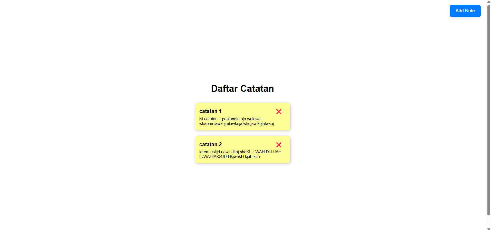
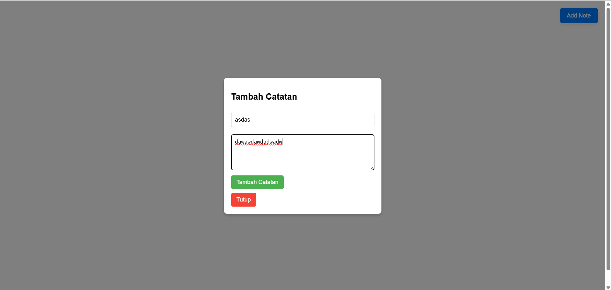
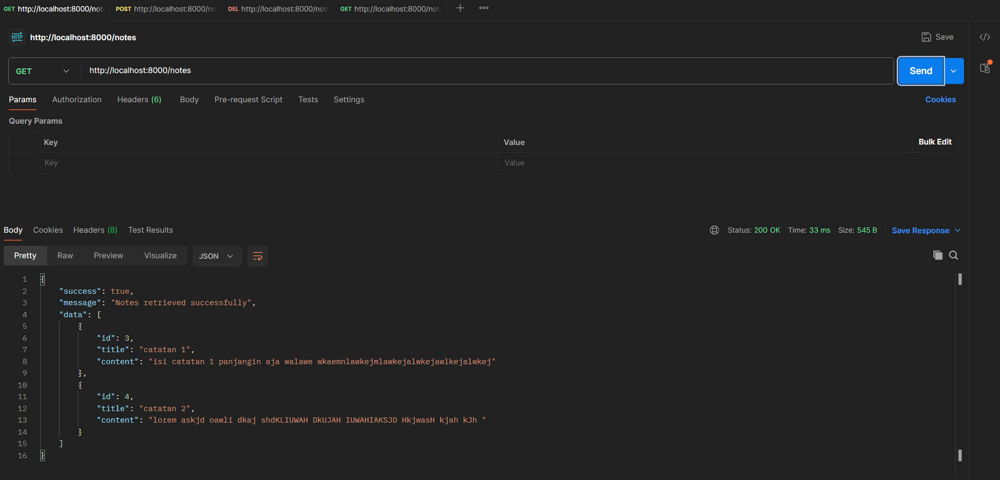
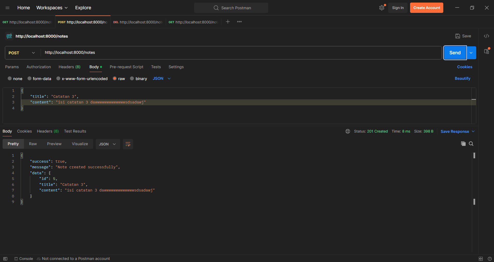
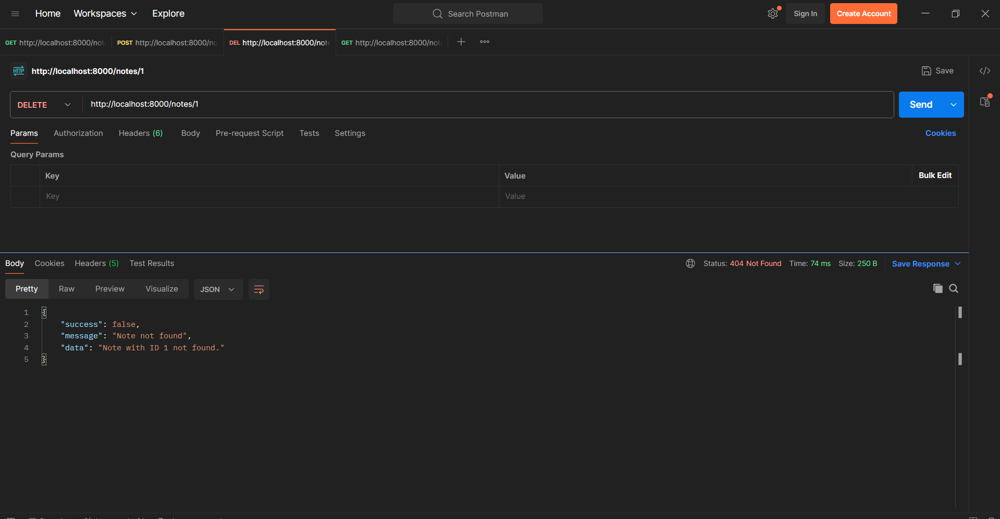
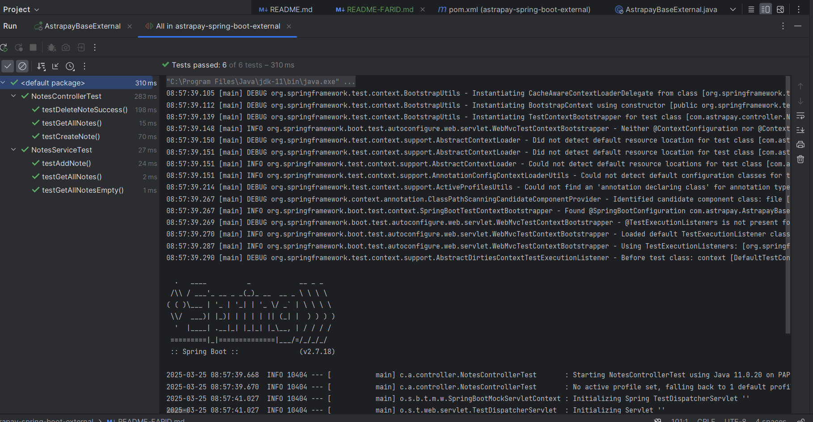

# Simple Notes App

Aplikasi **Simple Notes** adalah aplikasi berbasis **Spring Boot** untuk backend dan **Angular** untuk frontend yang memungkinkan pengguna untuk menambah, melihat, dan menghapus catatan. Aplikasi ini menggunakan **In-Memory Database** untuk menyimpan data catatan sementara, tanpa memerlukan koneksi ke database eksternal.

## Fitur
1. Menambah catatan baru.
2. Menampilkan daftar catatan yang telah ditambahkan.
3. Menghapus catatan yang sudah ada.

## Teknologi yang Digunakan
- **Backend**: Spring Boot
    - REST API
    - In-Memory Storage (tanpa database eksternal)
- **Frontend**: Angular
    - HTTP Client untuk komunikasi dengan backend

## Prasyarat
Sebelum memulai, pastikan Anda memiliki alat-alat berikut terinstal di komputer Anda:

1. [Java JDK 11+](https://adoptopenjdk.net/)
2. [Maven](https://maven.apache.org/)
3. [Node.js dan npm](https://nodejs.org/)
4. [Git](https://git-scm.com/)

## Menjalankan Aplikasi

### Langkah 1: Menjalankan Backend (Spring Boot)
1. Clone repository ini:
    ```bash
    git clone git clone https://github.com/farid-fauzan/astrapay-spring-boot-external.git
    ```
2. Masuk ke direktori `astrapay-spring-boot-external`:
    ```bash
    cd astrapay-spring-boot-external
    ```
3. Jalankan aplikasi Spring Boot menggunakan Maven:
    ```bash
    ./mvnw spring-boot:run
    ```
4. Aplikasi backend akan berjalan di `http://localhost:8000`.

### Langkah 2: Menjalankan Frontend (Angular)
1. Clone Repository : 
    ```bash
    git clone git clone https://github.com/farid-fauzan/angular-notes
    ```
2. Masuk ke direktori `my-angular-project`:
    ```bash
    cd my-angular-project
    ```
3. Install dependensi frontend menggunakan npm:
    ```bash
    npm install
    ```
4. Jalankan aplikasi Angular:
    ```bash
    npm start
    ```
5. Aplikasi frontend akan berjalan di `http://localhost:4200`.

### Langkah 3: Menggunakan Aplikasi
1. Buka browser dan pergi ke `http://localhost:4200`.
2. Anda dapat melihat daftar catatan dan menambah catatan baru menggunakan form.
3. Klik ikon sampah di setiap catatan untuk menghapusnya.

## Struktur Proyek

### Backend (Spring Boot)
- `src/main/java/com/example/simplenotes/`
    - `controller/` - Berisi controller REST API.
    - `model/` - Berisi model data seperti Note.
    - `repository/` - Berisi repository untuk akses data.
    - `service/` - Berisi logika bisnis.
    - **In-Memory Data Store** digunakan untuk menyimpan data catatan, tanpa menggunakan database eksternal.

### Frontend (Angular)
- `src/app/`
    - `note-list/` - Komponen untuk menampilkan daftar catatan.
    - `add-note/` - Komponen untuk menambah catatan baru.

## API Documentation
- **GET** `/notes` : Mengambil daftar catatan.
    - Response: `200 OK`, dengan data berupa daftar catatan.
- **POST** `/notes` : Menambahkan catatan baru.
    - Request body: `{ "title": "string", "content": "string" }`
    - Response: `201 Created`, dengan data catatan baru yang ditambahkan.
- **DELETE** `/notes/{id}` : Menghapus catatan berdasarkan ID.
    - Response: `200 OK`, jika catatan berhasil dihapus.

## Screenshot

1. **Frontend**  
   
   

2. **Backend (Postman)**  
   
   
   
3. **Unit Test**
   

## Kontribusi
Jika Anda ingin berkontribusi pada proyek ini, silakan lakukan fork pada repository ini dan kirimkan pull request dengan penjelasan tentang perubahan yang Anda buat.

## Lisensi
Proyek ini menggunakan lisensi MIT. Lihat [LICENSE](LICENSE) untuk lebih lanjut.
